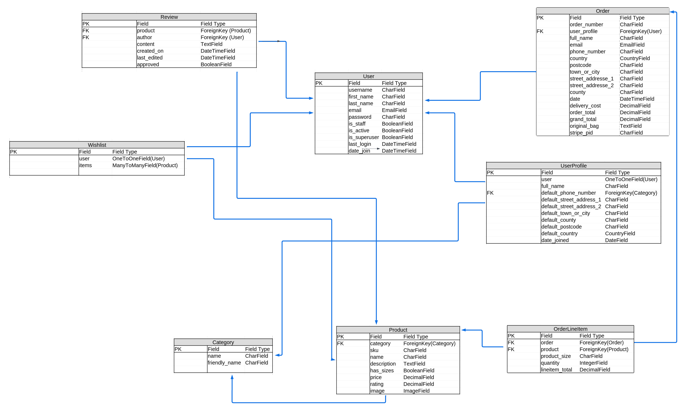

# VintAge
Welcome to VintAge, your ultimate destination for unique and timeless vintage products. Our online store offers a curated selection of high-quality vintage items, ranging from clothing and accessories to home decor and collectibles. Each piece is handpicked for its authenticity, charm, and character, ensuring that our customers receive only the finest vintage treasures.


[The deployed website can be found here](https://vint-age-f72b1a14d20f.herokuapp.com/)

## Contents

1. [About](#1-about)
2. [User Experience (UX)](#2-user-experience-ux)
3. [Agile Development](#3-agile-development)
4. [Design](#4-design)
5. [Database Design](#5-database-design)
6. [features](#6-features)
7. [Technologies Used](#6-technologies-used)
8. [Search Engine Optimization and Web Marketing](#6-search-engine-optimization-and-web-marketing)
9. [Local Development and Deployment](#7-local-development-and-deployment)
10. [Testing](#8-testing)
11. [Credits](#9-credits)
12. [Acknowledgement](#10-acknowledgement)

## 1. About
VintAge is an e-commerce platform dedicated to providing a seamless shopping experience for vintage enthusiasts. Our collection features a diverse array of products that celebrate the elegance and nostalgia of bygone eras. Whether you're looking for a statement piece to add to your wardrobe, a unique item to decorate your home, or a rare collectible to complete your collection, you'll find it at VintAge.

### Key Features:

- Curated Selection: Each item in our store is carefully chosen for its quality, authenticity, and unique appeal.
- User-Friendly Interface: Our website is designed to offer a smooth and enjoyable shopping experience, with easy navigation and a clean, aesthetic layout.
- Detailed Descriptions: We provide comprehensive descriptions and high-resolution images for all products, so you can make informed purchasing decisions.
- Secure Transactions: Our platform ensures the safety and security of your personal and payment information with state-of-the-art encryption technology.
- Excellent Customer Service: Our dedicated customer support team is always ready to assist you with any questions or concerns.

## 2. User Experience (UX)

### User Stories

User stories were generated through GitHub Issues, with story points assigned based on estimated task completion times. Milestones and appropriate tags were also applied for organization.

Explore the user stories below in the section labeled [User Story Testing](### User Story Testing), and delve deeper into comprehensive details, including screenshots, story points, milestones, and tags, by visiting [GitHub Issues](https://github.com/vega-2135/the_pancake_palace/issues).

## 3. Agile Development

The project development at VintAge was guided by Agile principles, allowing iterative and incremental enhancements to the projects's design throughout its evolution. leveraging GitHub's robust features to implement Scrum methodology effectively.GitHub Issues served as the backbone of the product backlog, housing detailed user stories. GitHub Issues' tagging feature was used to assign story points, prioritize features using the MoSCoW method, and categorize user stories for streamlined development. Additionally, GitHub's Milestones feature aided in sprint planning and deadline setting, ensuring timely delivery of project milestones.

Utilizing GitHub Issues and Projects, I meticulously managed each aspect of my project, organizing them into Epics and further breaking them down into User Stories with associated Tasks. Epics represented significant features, while User Stories were prioritized as mentioned using the MoSCoW technique, ensuring efficient allocation of resources.

GitHub's Project board provided a visual representation of our progress, utilizing a [kanban board](https://github.com/users/vega-2135/projects/4) approach to track user story development from 'Todo' to 'Done', with each stage signifying the completion of specific development milestones.


Furthermore, GitHub milestones were employed to group related user stories, enhancing project organization and cohesion which additionally aided in sprint planning and deadline setting, ensuring timely delivery of project milestones.


## 4. Design

### Structure
The VintAge app boasts a straightforward layout, prioritizing user-friendliness and seamless navigation. Its uniform page structure ensures users can effortlessly locate desired information. With a responsive design, the app adapts seamlessly across various devices, guaranteeing clear visibility. All pages show a navigation menu that offers users a consistent means to explore the site's content. Employing CSS and Bootstrap rows and columns, the app maintains a tidy and cohesive content arrangement throughout its pages.

### Colour Scheme

The color Greyish Teal (rgb(109, 154, 156)) was chosen as the background color for the message below the navigation bar stating "Free Delivery on Orders over 50$". This color was also chosen for the border of the subscription box.

The color Pale Blue Lilly (rgb(201, 237, 241)) was chosen as the background color of the div containing the text "The New Accessories are Here" and the Shop Now button.

The color white was chosen as the background color of the rest of the website and also as the font color of the free delivey message at the homepage.

The color black was chosen as the font color for all text on the website, as it provides the best contrast with the white background of the website.

### Typography

In crafting the typography for our website, deliberate consideration was given to ensure optimal readability and aesthetic appeal. To achieve this balance, we've selected the versatile and modern Lato font as the primary typeface throughout the entire site. Renowned for its clean lines, readability, and versatility across various screen sizes and resolutions, Lato offers a seamless reading experience. Its uniformity and clarity elevate the presentation of content, ensuring that users can effortlessly engage with our platform's offerings. By employing Lato consistently across all text elements, from headers to paragraphs, I aim to deliver a cohesive and visually pleasing browsing experience to users.

### Wireframes
- [Home Page](docs_readme/wireframes/homepage.png)
- [Products Page](docs_readme/wireframes/products_page.png)
- [Product Detail Page](docs_readme/wireframes/product_detail_page.png)
- [Contact Us](docs_readme/wireframes/contact_us_page.png)
- [FAQs Page](docs_readme/wireframes/faq_page.png)

### Additional
The logo of the website was taken from [flaticon.com](https://www.flaticon.com/) page and converted in a logo using a [favicon generator webapp](https://favicon.io/)
 app boasts a straightforward layout, prioritizing user-friendliness and seamless navigation. Its uniform page structure ensures users can effortlessly locate desired information. With a responsive design, the app adapts seamlessly across various devices, guaranteeing clear visibility. All pages show a navigation menu that offers users a consistent means to explore the site's content. Employing CSS and Bootstrap rows and columns, the app maintains a tidy and cohesive content arrangement throughout its pages.

## 5. Database Design
LibreOffice spreadsheet was used for designing the models, followed by integrating them into a single cohesive image using Lucidchart. In this project, the Django User model was used and is incorporated into the image to illustrate its connection with the other project models.

Models:



## 6. Features

- ### Home Page
The homepage features a concise overview of the website's purpose alongside a link to all the products of the store and a section to subscribe to receive emails about recent offers, new deals and arrivals, enticing visitors with a glimpse of the new products awaiting them. A prominent navigation bar grants seamless access to every corner of the site, ensuring users can easily explore and discover a plethora of different products from clothing to deco items.

<details>
<summary>Home Page Screenshot</summary>


</details>

- ### Navbar
The navbar is designed to adapt to different screen sizes and contains essential features for user navigation. It prominently displays the website logo and incorporates a search box, enabling users to find products based on specific keywords. Additionally, there are distinct buttons for user registration and login, facilitating access to enhanced functionality within the site.

Once users register or log in, the options in the My Account dropdown menu transform, displaying convenient links to check their personalized profile page. This profile page contains fields the user can edit, allowing for a more rapid payment of checkout products. The My Account menu also displays a link for logging out of the site and a link to check the products added to their wishlist. Below the aforementioned navbar options, there are five additional options available:

-Six categories of products, each leading to a page containing products dedicated to that category. The categories are: All Products, Clothing, Music, Mobility, Deco, and Special Offers.
- Two links to the 'Contact Us' and 'FAQs' pages, providing users with a means to get in touch and additional information about the website.

This layout ensures that users can easily navigate through the website, explore all items the store has to offer, and access essential pages for further engagement or inquiries.

<details>
<summary>Nav Bar Screenshots</summary>


</details>

- ### User Authentication
The VintAge website employs the Django Allauth package to manage user authentication and grant authenticated users access to CRUD functionalities. This package furnishes a suite of views and templates dedicated to user registration, login, and logout processes. Throughout the website, defensive programming techniques have been implemented to safeguard against unauthorized access to pages lacking appropriate permissions. Django's LoginRequired mixin is utilized to restrict access to anonymous users, redirecting them to the login page when attempting to view restricted content, for example only the original author of a recipe can make edits of comments or submitted recipes. Unauthorized attempts trigger redirection to a 403 error page, notifying users of their lack of permission to execute the action. Furthermore, for access to the admin panel, users must hold either 'superuser' or 'staff status' permissions.

<details>
<summary>User Authentication Screenshots</summary>


</details>

- ### Products Page
The Product Page displays all the products that belong to a given category. At the top right of this page, there is a link that redirects users to a page showing all products and a number that represents the total number of products available for a given category. Additionally, there is a dropdown menu to sort the products by price, rating, name, and category.

Each product listing on the page features an image of the product, followed by the product name, price, category, and rating. For admin users, "Edit" and "Delete" buttons are displayed to the right of the product rating. Clicking the "Edit" button directs the admin user to a page where they can edit the details of the given product (image, name, price, etc.). Clicking the "Delete" button removes the product from the website and the database.

<details>
<summary>Products Page Screenshots</summary>


</details>

- ### Products Detail Page
The Product Detail Page displays an image of the product. To the right of the product image, a detailed description is shown, including, from top to bottom:

- The name of the product
- The price of the product
- The category the product belongs to
- The current rating of the product
- A text providing more information about the product
- A quantity box where users can specify the number of items they wish to purchase
- Buttons to keep shopping, add to bag, and add to wishlist.

Upon clicking the "Add To Bag" button, a message pops out informing the user that the product has been added to the shopping bag.

<details>
<summary>Product Detail Page Screenshots</summary>


</details>

- ### Shopping Bag Page
The Shopping Bag Page displays rows of products that have been added to the shopping bag. Each row features an image of the product followed by a small description, including the product's SKU and size (when applicable). The price, quantity, and subtotal for each product are also shown.

The quantity section includes a spinner control menu that allows the user to increase or decrease the number of items they want to purchase for a given product. It also includes update and remove options. The update option adjusts the quantity of a product if the user changes it, while the remove option deletes the product entirely from the shopping bag.

At the bottom right of the page, the following details are displayed:

- Bag Total: the total price of the products without delivery costs
- Delivery Cost
- Grand Total: the total price of all items in the shopping bag, including delivery costs
- Buttons that direct users to the page with all the products on the website ("Keep Shopping") and to the secure checkout page, where users can add the required information for the payment of the products.


<details>
<summary>Shopping Bag Page Screenshots</summary>


</details>


- ### Checkout Page
The Checkout Page features three forms on the right side of the page: one for the user's personal details, one for the delivery information, and one for the payment details. Users must provide their card information in the payment form to complete the purchase. On the left side of these forms, the order summary is displayed.

At the bottom of the page, below the payment form, there are two buttons: the "Adjust Bag" button, which allows users to modify the items or quantities of items they want to purchase, and the "Complete Order" button, which finalizes the payment and checkout process for the purchased products.

Once users fill in all the required fields and click the "Complete Order" button, a loading symbol appears at the center of the page. After a few seconds, a new page loads, and the text "Thank You" appears at the top left of the page, followed by the order information. A success message also appears, informing the user that the order was successfully processed. The message includes the order number and confirmation that a confirmation email will be sent to the email address provided in the personal details form.


<details>
<summary>Checkout Page Screenshots</summary>


</details>

- ### Wishlist Page
The Wishlist Page displays the products that users have added to their wishlist from the product detail page. The page shows the added products with the same information and styles as those on the products page. An additional "Remove from Wishlist" button is located below the rating information of each product. Clicking this button removes the given product from the user's wishlist. When a product is removed from the wishlist, a message pops up informing the user that the product was successfully deleted from t

<details>
<summary>Wishlist Page Screenshots</summary>


</details>


- ### My Profile Page
The My Profile Page features a form on the right side of the page where users can fill in their personal and delivery information. Users can edit and update this information at any time, and a success message will appear at the top right of the page informing the user that their profile was successfully updated. If a field is filled in on the My Profile Page, the same field on the checkout page will be automatically populated, allowing for a faster checkout experience. On the left side of the page, the order history of the user is displayed, showing all the products the user has purchased since they created an account on the site.


<details>
<summary>My Profile Page Screenshots</summary>


</details>


- ### Contact Us Page
All users can contact customer service by clicking in the Contact Us option of the navbar. Users can leave a message for comments, questions or suggestions about the site or products.


<details>
<summary>Contact Page Screenshot</summary>


</details>


- ### FAQs Page
The FAQs page provides a brief description of the page content followed by answers to the most frequently asked questions from users.


<details>
<summary>FAQs Page Screenshot</summary>


</details>


- ### Admin Panel
The Django admin panel is accessible to 'superusers' and users granted the 'staff status' permission. This panel serves as a central hub for managing site content. Each data model is seamlessly integrated into the admin interface using the register decorator. This allows for easy access and management of various functionalities, including adding or removing recipes, reviewing contact messages, setting the approval status of recipes and comments, as well as managing user accounts for cases of inappropriate behavior on the site. Additionally, the admin panel facilitates the addition of descriptions found on the About page.


<details>
<summary>Admin Panel Screenshot</summary>


</details>


- ### Product Management Page
The Product Management Page allows users with admin accounts to add products directly, bypassing the need to visit the admin panel. The page displays a form with all the necessary fields to add a new product to the store. At the bottom of the form, users can either cancel the action or add the product. Upon clicking the "Add Product" button, a success message appears at the top right of the page, informing the user that the product was successfully added to the online store.


<details>
<summary>Product Management Page Screenshot</summary>


</details>

- ### Footer
The footer contains the copyright information and the icons for facebook, twitter and instagram pages.


<details>
<summary>Search Recipes Screenshot</summary>


</details>


- ### Future Features

## 7. Technologies Used
### Languages

- [HTML5](https://en.wikipedia.org/wiki/HTML5)
- [CSS3](https://en.wikipedia.org/wiki/CSS)
- [JavaScript](https://en.wikipedia.org/wiki/JavaScript)
- [Python](https://en.wikipedia.org/wiki/Python_(programming_language))

### Frameworks, Libraries and Packages

- [Django 4.2.1](https://docs.djangoproject.com/en/3.2/)
- [Bootstrap 5](https://getbootstrap.com/)
- [jQuery 3.7.1](https://releases.jquery.com/)
- [Font Awesome 6.5.2](https://fontawesome.com/)
- [Google Fonts](https://fonts.google.com/)
- [django-crispy-forms](https://django-crispy-forms.readthedocs.io/en/latest/)
- [cripsy-bootstrap5](https://github.com/django-crispy-forms/crispy-bootstrap5)
- [django-allauth](https://django-allauth.readthedocs.io/en/latest/)
- [django-dynamic-formset](https://github.com/elo80ka/django-dynamic-formset)
- [django-autoslug](https://django-autoslug.readthedocs.io/en/stable/)
- [django-taggit](https://django-taggit.readthedocs.io/en/stable/)

### Tools

- [GitHub:](https://github.com/) used for version control, collaborative development and code management.

- [Google Fonts:](https://fonts.google.com/) used to import and apply a variety of fonts to enhance the visual appeal of the website.

- [VSCode (Visual Studio Code):](https://code.visualstudio.com/) used for writing, editing, and debugging the code for this webapp.

- [Techsini:](https://techsini.com/multi-mockup/) used to create mockup images of home page in different devices (phone, ipad, laptop, desktop).

- [Balsamiq:](https://balsamiq.com/) used to generate wireframes of the page.

- [Heroku:](https://dashboard.heroku.com/) used for the deployment of the application.

- [Lucid Chart:](https://www.lucidchart.com/) used for making a flow chart of the project models.

- [ElephantSQL](https://www.elephantsql.com/) used for storing and managing the project database.

- [Cloudinary](https://cloudinary.com/) used for storing images uploaded by users.

- [Bulkresizephotos](https://bulkresizephotos.com/en?format=webp&quality=93) used for changing extension and size of the recipe's images.

- [favicon.io](https://favicon.io/) used for the logo of the website.

- [The W3C Markup Validation Service](https://validator.w3.org/) used to validate code in html files.

- [The W3C CSS Validation Service](https://jigsaw.w3.org/css-validator/) used to validate css code.

- [Code Institute Python Linter](https://pep8ci.herokuapp.com/) used to validate code in .py files.

- [JSHint](https://jshint.com/) sed to validate javascript code.

- [Firefox DevTools](https://developer.chrome.com/docs/devtools/) used for debugging of css code.

## 8. Search ENgine Optimization and Web Marketing
When planning the project, an important step was to consider SEO strategies to achieve a high-quality product that ranks well in search engines. The content of this website was created with the idea of building a vintage e-commerce site, taking into account the users' needs. The information on the website is easy to understand and demonstrates expertise, authoritativeness, and trustworthiness.

Key changes implemented to achieve this include:

- Planning keywords for the meta sections of the HTML file and throughout the site's content.
- Choosing names and alt text for all images to match the site’s keywords, increasing the chances of a higher quality evaluation from search engines.
- Creating an FAQs section to help and guide users with any questions about the site or products, while also contributing to a high-quality product that can potentially rank high in search engines.
- Selecting tags to attract clicks from users, such as span, h1, and h2.
- Utilizing sitemap.xml and robots.txt files.
- Creating a Facebook page for VintAge online store
[VintAge Facebook Page Link](https://www.facebook.com/profile.php?id=61560058197456)


## 9. Deployment
Below are detailed instructions on how to clone this project repository and the steps to configure and deploy the application.

<details>
<summary>1. Fork Repository</summary>

- Log in to GitHub.
- Go to the repository for this project (<https://github.com/vega-2135/vint-age>).
- In the top-right corner of the page, click "Fork".
- Under "Owner", select an owner for the repository from the dropdown menu.
- Optionally, in the "Description" field, type a description of your fork.
- To copy the main branch only, select the "Copy the main branch only" check box. If you do not select this option, all branches will be copied into the new fork.
- Click "Create fork"
</details>

<details>
<summary>2. Cloning Your Forked Repository</summary>

- Log-in to GitHub.com, navigate to your fork of the repository.
- Above the list of files, click Code.
- Copy the URL for the repository.
  - To clone the repository using HTTPS, under "Clone with HTTPS", click the "Copy" icon.
  - To clone the repository using an SSH key, including a certificate issued by your organization's SSH certificate authority, click SSH, then click the "Copy" icon.
  - To clone a repository using GitHub CLI, click Use GitHub CLI, then click the "Copy" icon.
- Open Git Bash
- Change the current working directory to the location where you want the cloned directory.
- Type git clone, and then paste the URL you copied earlier.
- Press Enter. Your local clone will be created.

For more details about forking and cloning a repository, please refer to [GitHub documentation](https://docs.github.com/en/get-started/quickstart/fork-a-repo).
</details>

<details>
<summary>3. Install Dependencies</summary>

Use the `pip install -r requirements.txt` command to install all of the Python modules and packages listed in your requirements.txt file.
</details>

<details>
<summary>4. Create your env.py</summary>

- In your project workspace, create a file called env.py and make sure this file is included in the .gitignore file.
- Add the following code:

```python

import os

os.environ["DATABASE_URL"]='<copiedURL>'
os.environ['SECRET_KEY'] = '<ADD YOUR SECRET KEY HERE>'
import os

os.environ.setdefault(
    "STRIPE_PUBLIC_KEY",
    "<ADD YOUR PUBLIC KEY HERE>",
)
os.environ.setdefault(
    "STRIPE_SECRET_KEY",
    "<ADD YOUR SECRET KEY HERE>",
)
os.environ.setdefault(
    "STRIPE_WH_SECRET",
    "<ADD YOUR WH SECRET KEY HERE>",
)
os.environ.setdefault(
    "DATABASE_URL",
    "<copiedURL>",
)

os.environ.setdefault("AWS_ACCESS_KEY_ID", "<ADD YOUR AWS ACCESS KEY HERE>")
os.environ.setdefault(
    "AWS_SECRET_ACCESS_KEY", "<ADD YOUR AWS SECRET ACCESS KEY HERE>"
)
os.environ.setdefault("EMAIL_HOST_USER", "<ADD YOUR EMAIL HOST USER HERE>")
os.environ.setdefault("EMAIL_HOST_PASS", "<ADD YOUR EMAIL HOST PASSWORD HERE>")


```

- Replace `<TEXT BETWEEN ANGLE BRAKETS>` in the corresponding environment variables with your own secret keys or passwords.
- Save the file.
</details>

<details>
<summary>5. Create a Database</summary>

- Create an account and log in with ElephantSQL.com.
- From the dashboard click “Create New Instance”.
- Set up your plan
  - Give your plan a Name
  - Select a plan tier
  - You can leave the Tags field blank
- Select “Select Region”
- Select a data center near you
- Then click “Review”
- Check your details are correct and then click “Create instance”
- Return to the ElephantSQL dashboard and click on the database instance name for this project
- In the URL section, click the copy icon to copy the database URL
- In your env.py file replace `<copiedURL>` in the DATABASE_URL environment variable with the copied URL.
- Save the file.
</details>

<details>
<summary>6. Set Up AWS</summary>
AWS has been used as the cloud host for imagery. To implement this you will need and AWS account and to create an S3 Bucket and User Profile. Developer guidance can be followed on AWS's site.

To serve the images you will need to add the following config to your settings.py file.

```
if 'USE_AWS' in os.environ:
    # Cache control
    AWS_S3_OBJECT_PARAMETERS = {
        'Expires': 'Thu, 31 Dec 2099 20:00:00 GMT',
        'CacheControl': 'max-age=94608000',
    }
    # Bucket config
    AWS_STORAGE_BUCKET_NAME = 'the-coffee-collective'
    AWS_S3_REGION_NAME = 'eu-west-2'
    AWS_ACCESS_KEY_ID = os.environ.get('AWS_ACCESS_KEY_ID')
    AWS_SECRET_ACCESS_KEY = os.environ.get('AWS_SECRET_ACCESS_KEY')
    AWS_S3_CUSTOM_DOMAIN = f'{AWS_STORAGE_BUCKET_NAME}.s3.amazonaws.com'
    # Static and media files
    STATICFILES_STORAGE = 'custom_storages.StaticStorage'
    STATICFILES_LOCATION = 'static'
    DEFAULT_FILE_STORAGE = 'custom_storages.MediaStorage'
    MEDIAFILES_LOCATION = 'media'
    # Override static and media URLs in Production
    STATIC_URL = f'https://{AWS_S3_CUSTOM_DOMAIN}/{STATICFILES_LOCATION}'
    MEDIA_URL = f'https://{AWS_S3_CUSTOM_DOMAIN}/{MEDIAFILES_LOCATION}'
```
</details>

<details>
<summary>7. Set Up Stripe</summary>
Stripe has been used to receive payments from customers. To implement this functionality, you need to register an account in Stripe and follow the [documentation](https://stripe.com/docs) to incorporate the guided HTML, Python and JavaScript code. Be sure to add the secret key generated with Stripe to your Heroku Config Variables and in the settings.py file as described in the documentation.

Once Stripe is activated you can test the checkout process with a test credit card detail provided by Stripe. Please use these details (below) and not real card details as there is no guarantee that your mony can be returned as this is a fictitious site. In the stripe's documentation, there are a few tests cards details that you can use for different tests of the checkout process using stripe.

Example of test card details(found onstripe documentation):

| CARD NO             | MM / YY | CVC | Post Code |
| ------------------- | ------- | --- | --------- |
| 4242 4242 4242 4242 | 04 / 24 | 242 | 42424     |
</details>

<details>
<summary>8. Heroku Account Setup</summary>
1. Create an account in Heroku (if you don't have one).

2. Navigate to the Heroku dashboard and click on the "Create new app" button.

3. Choose a unique name for your app, select the region, and then click "Create app".

Configuration of Variables

4. On the Application Configuration page for the new app, click on the Resources tab.

5. Next, click on Settings on the Application Configuration page and click on "Reveal Config Vars".

6. Add a new Config Var called DISABLE_COLLECTSTATIC and assign it a value of 1, and click Add to save it. Remove this when releasing for Production.

7. Add a new Config Var called SECRET_KEY and assign it a value - any random string of letters, digits and symbols, and click Add to save it.

8. Add a new Config Var called DATABASE_URL and paste in the value for your ElephantSQL database, and click Add to save it.

9. The settings.py file should be updated to use the DATABASE_URL and SECRET_KEY environment variable values as follows :

    DATABASES = {'default': dj_database_url.parse(os.environ.get('DATABASE_URL'))}

    SECRET_KEY = os.environ.get('SECRET_KEY')

10. In Gitpod, in the project terminal window, to initialize the data model in the postgres database, run the command : python3 manage.py migrate

11. Update the requirements.txt file with all necessary supporting files by entering the command : pip freeze > requirements.txt

12. Commit and push any local changes to GitHub.

13. In order to be able to run the application on localhost, add SECRET_KEY and DATABASE_URL and their values to env.py.

Connect GitHub Repository to Heroku App

1. Navigate to Application Configuration page for the application on Heroku and click on the Deploy tab.
1. Select GitHub as the Deployment Method and if prompted, confirm that you want to connect to GitHub. Enter and search for the required repository, then click on Connect to link them up..
1. Scroll down the page and choose to either Automatically Deploy each time changes are pushed to GitHub, or Manually deploy - I chose the latter for the initial deployment to watch the build and then opted for Automatic Deployment.
1. The application can be run from the Application Configuration page by clicking on the Open App button.
1. Each time you push code from your GitHub Repo it will be automatically reflected in your Heroku App.
</details>

<details>
<summary>9. Pre Production Deployment Configuration</summary>

In Your Django Project code:
1. Set DEBUG flag to False in settings.py
1. Update the requirements.txt file with all necessary supporting files by entering the command : pip freeze > requirements.txt
1. Commit and push code to GitHub

In the Heroku App:
1. Settings > Config Vars : Delete environment variable : DISABLE_COLLECTSTATIC
1. Deploy : Click on deploy branch
</details>

## 10.

## 11. Credits

- ### Code
Much of the coding and testing relies heavily on information in the "Boutique Ado" walkthrough in the Code Institue Building an E-Commerce Platform module.


- ### Images
- Foro all the products images, phtoleap mobile app was used for creating the images. 

- Pexels was used for the images in the homepage.
[Image at the top of page](https://www.pexels.com/photo/man-in-bus-247929/)
[Image of girl with an old camera](https://www.pexels.com/photo/little-girl-taking-photo-on-vintage-instant-photo-camera-5560466/)

- The icon of the page was taken from [flaticon.com](https://www.flaticon.com/free-icon/old-camera_6373842?term=vintage+camera&page=1&position=6&origin=tag&related_id=6373842) and then uploaded to [favicon generator](https://favicon.io/)

- Error pages:
[400 and 404 Error Pages Image](https://www.freepik.com/free-vector/404-error-background-flat-style_1825302.htm#query=404%20background&position=25&from_view=keyword&track=ais&uuid=a5621bc7-ebb8-4dab-b635-d6a2928c04fa)

[403 Error Page Image](https://www.freepik.com/free-vector/403-error-forbidden-with-police-concept-illustration_7938324.htm#fromView=search&page=1&position=1&uuid=e30b37c7-600d-46ca-8b16-4f27f3ccc261)

[500 Error Page Image](https://www.freepik.com/free-vector/data-scientist-data-analytics-manager-database-developer-administrator-working-big-data-job-database-developers-careers-big-data-concept_11667700.htm#fromView=image_search_similar&page=1&position=52&uuid=8390b579-7d08-4305-8972-36e5c14ddec5)

## 12. Acknowledgement
I'd like to thank my mentor Brian Macharia, for his invaluable guidance, feedback, tips, and the shared resources. 
