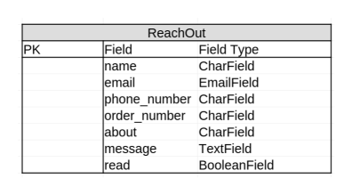

# VintAge
Welcome to VintAge, your ultimate destination for unique and timeless vintage products. Our online store offers a curated selection of high-quality vintage items, ranging from clothing and accessories to home decor and collectibles. Each piece is handpicked for its authenticity, charm, and character, ensuring that our customers receive only the finest vintage treasures.

[The deployed website can be found here](https://vint-age-f72b1a14d20f.herokuapp.com/)

## Contents

1. [About](#1-about)
2. [User Experience (UX)](#2-user-experience-ux)
3. [Agile Development](#3-agile-development)
4. [Design](#4-design)
5. [Database Design](#5-database-design)
6. [features](#6-features)
7. [Technologies Used](#6-technologies-used)
8. [Search Engine Optimization and Web Marketing](#6-search-engine-optimization-and-web-marketing)
9. [Local Development and Deployment](#7-local-development-and-deployment)
10. [Testing](#8-testing)
11. [Credits](#9-credits)
12. [Acknowledgement](#10-acknowledgement)

## 1. About
VintAge is an e-commerce platform dedicated to providing a seamless shopping experience for vintage enthusiasts. Our collection features a diverse array of products that celebrate the elegance and nostalgia of bygone eras. Whether you're looking for a statement piece to add to your wardrobe, a unique item to decorate your home, or a rare collectible to complete your collection, you'll find it at VintAge.

### Key Features:

- Curated Selection: Each item in our store is carefully chosen for its quality, authenticity, and unique appeal.
- User-Friendly Interface: Our website is designed to offer a smooth and enjoyable shopping experience, with easy navigation and a clean, aesthetic layout.
- Detailed Descriptions: We provide comprehensive descriptions and high-resolution images for all products, so you can make informed purchasing decisions.
- Secure Transactions: Our platform ensures the safety and security of your personal and payment information with state-of-the-art encryption technology.
- Excellent Customer Service: Our dedicated customer support team is always ready to assist you with any questions or concerns.

## 2. User Experience (UX)

### User Stories

User stories were generated through GitHub Issues, with story points assigned based on estimated task completion times. Milestones and appropriate tags were also applied for organization.

Explore the user stories below in the section labeled [User Story Testing](### User Story Testing), and delve deeper into comprehensive details, including screenshots, story points, milestones, and tags, by visiting [GitHub Issues](https://github.com/vega-2135/the_pancake_palace/issues).

## 3. Agile Development

The project development at VintAge was guided by Agile principles, allowing iterative and incremental enhancements to the projects's design throughout its evolution. leveraging GitHub's robust features to implement Scrum methodology effectively.GitHub Issues served as the backbone of the product backlog, housing detailed user stories. GitHub Issues' tagging feature was used to assign story points, prioritize features using the MoSCoW method, and categorize user stories for streamlined development. Additionally, GitHub's Milestones feature aided in sprint planning and deadline setting, ensuring timely delivery of project milestones.

Utilizing GitHub Issues and Projects, I meticulously managed each aspect of my project, organizing them into Epics and further breaking them down into User Stories with associated Tasks. Epics represented significant features, while User Stories were prioritized as mentioned using the MoSCoW technique, ensuring efficient allocation of resources.

GitHub's Project board provided a visual representation of our progress, utilizing a [kanban board](https://github.com/users/vega-2135/projects/4) approach to track user story development from 'Todo' to 'Done', with each stage signifying the completion of specific development milestones.

Furthermore, GitHub milestones were employed to group related user stories, enhancing project organization and cohesion which additionally aided in sprint planning and deadline setting, ensuring timely delivery of project milestones.

## 4. Design

### Structure
The VintAge app boasts a straightforward layout, prioritizing user-friendliness and seamless navigation. Its uniform page structure ensures users can effortlessly locate desired information. With a responsive design, the app adapts seamlessly across various devices, guaranteeing clear visibility. All pages show a navigation menu that offers users a consistent means to explore the site's content. Employing CSS and Bootstrap rows and columns, the app maintains a tidy and cohesive content arrangement throughout its pages.

### Colour Scheme

The color Greyish Teal (rgb(109, 154, 156)) was chosen as the background color for the message below the navigation bar stating "Free Delivery on Orders over 50$". This color was also chosen for the border of the subscription box.

The color Pale Blue Lilly (rgb(201, 237, 241)) was chosen as the background color of the div containing the text "The New Accessories are Here" and the Shop Now button.

The color white was chosen as the background color of the rest of the website and also as the font color of the free delivey message at the homepage.

The color black was chosen as the font color for all text on the website, as it provides the best contrast with the white background of the website.

### Typography

In crafting the typography for our website, deliberate consideration was given to ensure optimal readability and aesthetic appeal. To achieve this balance, we've selected the versatile and modern Lato font as the primary typeface throughout the entire site. Renowned for its clean lines, readability, and versatility across various screen sizes and resolutions, Lato offers a seamless reading experience. Its uniformity and clarity elevate the presentation of content, ensuring that users can effortlessly engage with our platform's offerings. By employing Lato consistently across all text elements, from headers to paragraphs, I aim to deliver a cohesive and visually pleasing browsing experience to users.

### Wireframes
- [Home Page](docs_readme/wireframes/homepage.png)
- [Products Page](docs_readme/wireframes/products_page.png)
- [Product Detail Page](docs_readme/wireframes/product_detail_page.png)
- [Contact Us](docs_readme/wireframes/contact_us_page.png)
- [FAQs Page](docs_readme/wireframes/faq_page.png)

### Additional
The logo of the website was taken from [flaticon.com](https://www.flaticon.com/) page and converted in a logo using a [favicon generator webapp](https://favicon.io/)
 app boasts a straightforward layout, prioritizing user-friendliness and seamless navigation. Its uniform page structure ensures users can effortlessly locate desired information. With a responsive design, the app adapts seamlessly across various devices, guaranteeing clear visibility. All pages show a navigation menu that offers users a consistent means to explore the site's content. Employing CSS and Bootstrap rows and columns, the app maintains a tidy and cohesive content arrangement throughout its pages.

## 5. Database Design
LibreOffice spreadsheet was used for designing the models, followed by integrating them into a single cohesive image using Lucidchart. In this project, the Django User model was used and is incorporated into the image to illustrate its connection with the other project models.

Models:

## 6. Features

- ### Home Page
The homepage features a concise overview of the website's purpose alongside a link to all the products of the store and a section to subscribe to receive emails about recent offers, new deals and arrivals, enticing visitors with a glimpse of the new products awaiting them. A prominent navigation bar grants seamless access to every corner of the site, ensuring users can easily explore and discover a plethora of different products from clothing to deco items.

Home Page Screenshot

- ### Navbar
The navbar is designed to adapt to different screen sizes and contains essential features for user navigation. It prominently displays the website logo and incorporates a search box, enabling users to find products based on specific keywords. Additionally, there are distinct buttons for user registration and login, facilitating access to enhanced functionality within the site.

Once users register or log in, the options in the My Account dropdown menu transform, displaying convenient links to check their personalized profile page. This profile page contains fields the user can edit, allowing for a more rapid payment of checkout products. The My Account menu also displays a link for logging out of the site and a link to check the products added to their wishlist. Below the aforementioned navbar options, there are five additional options available:

-Six categories of products, each leading to a page containing products dedicated to that category. The categories are: All Products, Clothing, Music, Mobility, Deco, and Special Offers.
- Two links to the 'Contact Us' and 'FAQs' pages, providing users with a means to get in touch and additional information about the website.

This layout ensures that users can easily navigate through the website, explore all items the store has to offer, and access essential pages for further engagement or inquiries.

Nav Bar Screenshots

- ### User Authentication
The VintAge website employs the Django Allauth package to manage user authentication and grant authenticated users access to CRUD functionalities. This package furnishes a suite of views and templates dedicated to user registration, login, and logout processes. Throughout the website, defensive programming techniques have been implemented to safeguard against unauthorized access to pages lacking appropriate permissions. Django's LoginRequired mixin is utilized to restrict access to anonymous users, redirecting them to the login page when attempting to view restricted content, for example only the original author of a recipe can make edits of comments or submitted recipes. Unauthorized attempts trigger redirection to a 403 error page, notifying users of their lack of permission to execute the action. Furthermore, for access to the admin panel, users must hold either 'superuser' or 'staff status' permissions.

User Authentication Screenshots

- ### Products Page
The Product Page displays all the products that belong to a given category. At the top right of this page, there is a link that redirects users to a page showing all products and a number that represents the total number of products available for a given category. Additionally, there is a dropdown menu to sort the products by price, rating, name, and category.

Each product listing on the page features an image of the product, followed by the product name, price, category, and rating.

User Authentication Screenshots

- ### Products Detail Page
The Product Detail Page displays an image of the product. To the right of the product image, a detailed description is shown, including, from top to bottom:

- The name of the product,
- The price of the product,
- The category the product belongs to,
- The current rating of the product,
- A text providing more information about the product,
- A quantity box where users can specify the number of items they wish to purchase,
- Buttons to keep shopping, add to bag, and add to wishlist

User Authentication Screenshots

- ### Bag page

- ### Checkout Page

- ### Wishlist Page

- ### Profile Page

- ### Contact Us Page

- ### FAQs Page

- ### Admin Panel

- ### Adding New Products to Website

- ### Footer 

- ### Fure Features

## 7. Technologies Used
### Languages

- [HTML5](https://en.wikipedia.org/wiki/HTML5)
- [CSS3](https://en.wikipedia.org/wiki/CSS)
- [JavaScript](https://en.wikipedia.org/wiki/JavaScript)
- [Python](https://en.wikipedia.org/wiki/Python_(programming_language))

### Frameworks, Libraries and Packages

- [Django 4.2.1](https://docs.djangoproject.com/en/3.2/)
- [Bootstrap 5](https://getbootstrap.com/)
- [jQuery 3.7.1](https://releases.jquery.com/)
- [Font Awesome 6.5.2](https://fontawesome.com/)
- [Google Fonts](https://fonts.google.com/)
- [django-crispy-forms](https://django-crispy-forms.readthedocs.io/en/latest/)
- [cripsy-bootstrap5](https://github.com/django-crispy-forms/crispy-bootstrap5)
- [django-allauth](https://django-allauth.readthedocs.io/en/latest/)
- [django-dynamic-formset](https://github.com/elo80ka/django-dynamic-formset)
- [django-autoslug](https://django-autoslug.readthedocs.io/en/stable/)
- [django-taggit](https://django-taggit.readthedocs.io/en/stable/)

### Tools

- [GitHub:](https://github.com/) used for version control, collaborative development and code management.

- [Google Fonts:](https://fonts.google.com/) used to import and apply a variety of fonts to enhance the visual appeal of the website.

- [VSCode (Visual Studio Code):](https://code.visualstudio.com/) used for writing, editing, and debugging the code for this webapp.

- [Techsini:](https://techsini.com/multi-mockup/) used to create mockup images of home page in different devices (phone, ipad, laptop, desktop).

- [Balsamiq:](https://balsamiq.com/) used to generate wireframes of the page.

- [Heroku:](https://dashboard.heroku.com/) used for the deployment of the application.

- [Lucid Chart:](https://www.lucidchart.com/) used for making a flow chart of the project models.

- [ElephantSQL](https://www.elephantsql.com/) used for storing and managing the project database.

- [Cloudinary](https://cloudinary.com/) used for storing images uploaded by users.

- [Bulkresizephotos](https://bulkresizephotos.com/en?format=webp&quality=93) used for changing extension and size of the recipe's images.

- [favicon.io](https://favicon.io/) used for the logo of the website.

- [The W3C Markup Validation Service](https://validator.w3.org/) used to validate code in html files.

- [The W3C CSS Validation Service](https://jigsaw.w3.org/css-validator/) used to validate css code.

- [Code Institute Python Linter](https://pep8ci.herokuapp.com/) used to validate code in .py files.

- [JSHint](https://jshint.com/) sed to validate javascript code.

- [Firefox DevTools](https://developer.chrome.com/docs/devtools/) used for debugging of css code.

## 8.

## 9.

## 10.

## 11.

## 12. Acknowledgement
I'd like to thank my mentor Brian Macharia, for his invaluable guidance, feedback, tips, and the shared resources. 
